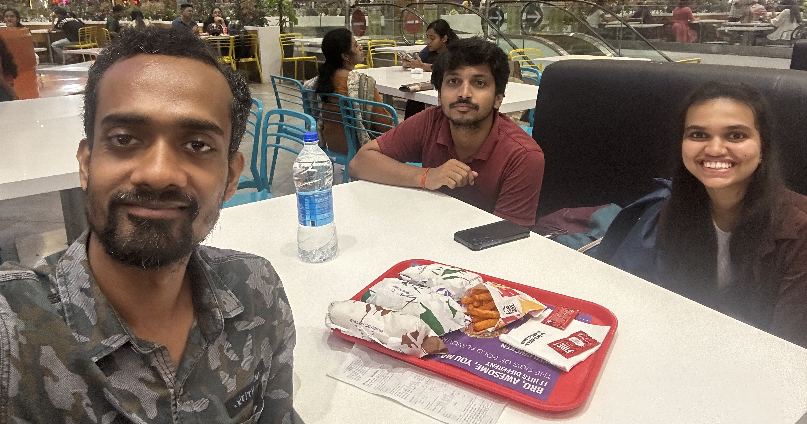
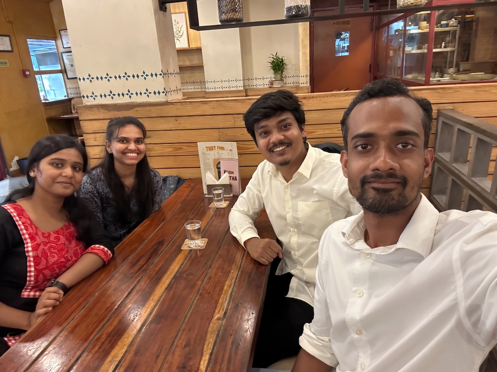

## Group social activities

---

## Group outings

### June 2026

  
   The IE2 Lab welcomed its first members &ndash; <a href="members#4-samanvitha-k-v-shankar">Samanvitha</a>, who joined as a Postdoctoral Researcher in June 2026, and <a href="members#5-sourabh-subhashish-panda">Sourabh</a>, who joined as a Summer Intern in May 2026 &ndash; with a welcome lunch in Salt Lake, Kolkata.
  

### July 2026

  
   The IE2 Lab bid adieu to <a href="members#5-sourabh-subhashish-panda">Sourabh</a>, who completed his time as a Summer Intern (time flies by!). We celebrated his farewell by watching the movie 'Oppenheimer', followed by dinner at Taco Bell. We wish him all the best for his future endeavors!
  

### August 2026

  
   The IE2 Lab keeps on expanding! We welcome the very first set of graduate students &ndash; <a href="members#2-payel-santra">Payel</a> and <a href="members#3-rushikesh-k-khandekar">Rushikesh</a>, who joined in August 2026. We celebrated their arrival with a grand lunch! We are so glad to have you on board and wish you both the very best for your journey ahead! 
  

---

## Related Pages

- [Members](members)