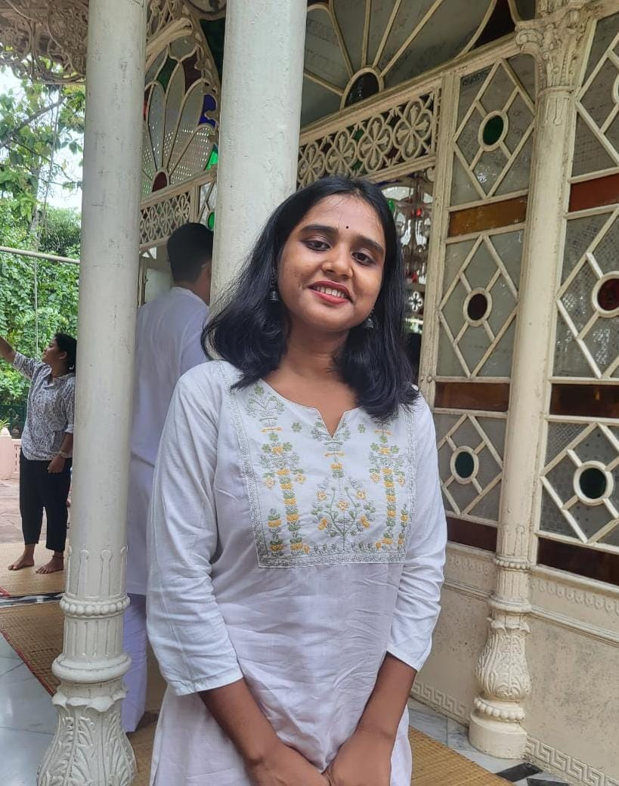
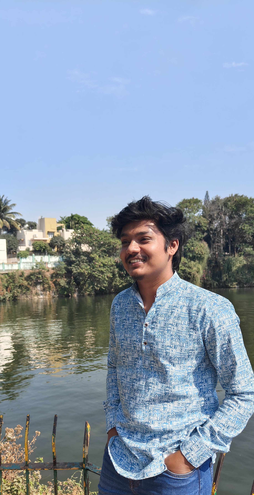

## PI (Ritesh Kumar)

  

    
  

  

### Education and experience

#### Eric & Wendy Schmidt AI in Science Fellow
**University of Chicago**, Chicago, IL, USA (2022 – 2026)

#### Ph.D. in Materials Science
**Indian Institute of Science**, Bangalore, India (2017 – 2022)

### Hobbies
Strength training & cardio, meditation, hiking, reading books, watching movies & TV shows

### Contact

  <a class="social-icon" href="mailto:ritesh.kumar@tcgcrest.org" title="Email" aria-label="Email">
    <svg xmlns="http://www.w3.org/2000/svg" viewBox="0 0 24 24" fill="none" stroke="currentColor" stroke-width="2" stroke-linecap="round" stroke-linejoin="round"><rect x="2" y="4" width="20" height="16" rx="2"/><path d="m22 7-8.97 5.7a1.94 1.94 0 0 1-2.06 0L2 7"/></svg>
  </a>
  <a class="social-icon" href="https://www.linkedin.com/in/ritesh-kumar-phd/" title="LinkedIn" aria-label="LinkedIn">
    <svg xmlns="http://www.w3.org/2000/svg" viewBox="0 0 24 24" fill="currentColor"><path d="M20.447 20.452h-3.554v-5.569c0-1.328-.027-3.037-1.852-3.037-1.853 0-2.136 1.445-2.136 2.939v5.667H9.351V9h3.414v1.561h.046c.477-.9 1.637-1.85 3.37-1.85 3.601 0 4.267 2.37 4.267 5.455v6.286zM5.337 7.433a2.062 2.062 0 0 1-2.063-2.065 2.064 2.064 0 1 1 2.063 2.065zm1.782 13.019H3.555V9h3.564v11.452zM22.225 0H1.771C.792 0 0 .774 0 1.729v20.542C0 23.227.792 24 1.771 24h20.451C23.2 24 24 23.227 24 22.271V1.729C24 .774 23.2 0 22.222 0h.003z"/></svg>
  </a>
  <a class="social-icon" href="https://scholar.google.com/citations?hl=en&user=GR3BoyYAAAAJ&view_op=list_works&sortby=pubdate" title="Google Scholar" aria-label="Google Scholar">
    <svg xmlns="http://www.w3.org/2000/svg" viewBox="0 0 24 24" fill="currentColor"><path d="M5.242 13.769 0 9.5 12 0l12 9.5-5.242 4.269C17.548 11.249 14.978 9.5 12 9.5c-2.977 0-5.548 1.748-6.758 4.269zM12 10a7 7 0 1 0 0 14 7 7 0 0 0 0-14z"/></svg>
  </a>

View Ritesh's full [CV](Ritesh_Kumar_CV.pdf) here.

  

---
## Graduate Students

## 1. Payel Santra

  

    
  

  

### Education and experience

#### M.Sc. in Physics
**Visva-Bharati University**, Sriniketan, India (2023 - 2025)

### Research direction(s)
Multiscale modeling for investigation of interfacial and interphasial phenomena

### Hobbies
Watching movies, listening audio books

### Contact

  <a class="social-icon" href="mailto:payel.santra_phd26@tcgcrestdtbu.ac.in" title="Email" aria-label="Email">
    <svg xmlns="http://www.w3.org/2000/svg" viewBox="0 0 24 24" fill="none" stroke="currentColor" stroke-width="2" stroke-linecap="round" stroke-linejoin="round"><rect x="2" y="4" width="20" height="16" rx="2"/><path d="m22 7-8.97 5.7a1.94 1.94 0 0 1-2.06 0L2 7"/></svg>
  </a>
  <a class="social-icon" href="#" title="LinkedIn" aria-label="LinkedIn">
    <svg xmlns="http://www.w3.org/2000/svg" viewBox="0 0 24 24" fill="currentColor"><path d="M20.447 20.452h-3.554v-5.569c0-1.328-.027-3.037-1.852-3.037-1.853 0-2.136 1.445-2.136 2.939v5.667H9.351V9h3.414v1.561h.046c.477-.9 1.637-1.85 3.37-1.85 3.601 0 4.267 2.37 4.267 5.455v6.286zM5.337 7.433a2.062 2.062 0 0 1-2.063-2.065 2.064 2.064 0 1 1 2.063 2.065zm1.782 13.019H3.555V9h3.564v11.452zM22.225 0H1.771C.792 0 0 .774 0 1.729v20.542C0 23.227.792 24 1.771 24h20.451C23.2 24 24 23.227 24 22.271V1.729C24 .774 23.2 0 22.222 0h.003z"/></svg>
  </a>
  <a class="social-icon" href="#" title="Google Scholar" aria-label="Google Scholar">
    <svg xmlns="http://www.w3.org/2000/svg" viewBox="0 0 24 24" fill="currentColor"><path d="M5.242 13.769 0 9.5 12 0l12 9.5-5.242 4.269C17.548 11.249 14.978 9.5 12 9.5c-2.977 0-5.548 1.748-6.758 4.269zM12 10a7 7 0 1 0 0 14 7 7 0 0 0 0-14z"/></svg>
  </a>

  

## 2. Rushikesh K. Khandekar

  

    
  

  

### Education and experience

#### M.Sc. in Physics
**Fergusson College**, SPPU, Pune, India (2023 - 2025)

### Research direction(s)
Developing AI models to accelerate the discovery of next-generation battery electrolytes

### Hobbies
Trekking, travelling, cooking

### Contact

  <a class="social-icon" href="mailto:rushikesh.sr_phd26@tcgcrestdtbu.ac.in" title="Email" aria-label="Email">
    <svg xmlns="http://www.w3.org/2000/svg" viewBox="0 0 24 24" fill="none" stroke="currentColor" stroke-width="2" stroke-linecap="round" stroke-linejoin="round"><rect x="2" y="4" width="20" height="16" rx="2"/><path d="m22 7-8.97 5.7a1.94 1.94 0 0 1-2.06 0L2 7"/></svg>
  </a>
  <a class="social-icon" href="#" title="LinkedIn" aria-label="LinkedIn">
    <svg xmlns="http://www.w3.org/2000/svg" viewBox="0 0 24 24" fill="currentColor"><path d="M20.447 20.452h-3.554v-5.569c0-1.328-.027-3.037-1.852-3.037-1.853 0-2.136 1.445-2.136 2.939v5.667H9.351V9h3.414v1.561h.046c.477-.9 1.637-1.85 3.37-1.85 3.601 0 4.267 2.37 4.267 5.455v6.286zM5.337 7.433a2.062 2.062 0 0 1-2.063-2.065 2.064 2.064 0 1 1 2.063 2.065zm1.782 13.019H3.555V9h3.564v11.452zM22.225 0H1.771C.792 0 0 .774 0 1.729v20.542C0 23.227.792 24 1.771 24h20.451C23.2 24 24 23.227 24 22.271V1.729C24 .774 23.2 0 22.222 0h.003z"/></svg>
  </a>
  <a class="social-icon" href="#" title="Google Scholar" aria-label="Google Scholar">
    <svg xmlns="http://www.w3.org/2000/svg" viewBox="0 0 24 24" fill="currentColor"><path d="M5.242 13.769 0 9.5 12 0l12 9.5-5.242 4.269C17.548 11.249 14.978 9.5 12 9.5c-2.977 0-5.548 1.748-6.758 4.269zM12 10a7 7 0 1 0 0 14 7 7 0 0 0 0-14z"/></svg>
  </a>

  

---

## Postdocs

## 1. Samanvitha K. V. Shankar

  

    
  

  

### Education and experience

#### M.Sc. in Physics
**Banaras Hindu University**, Varanasi, India (2020 - 2022)

#### Ph.D. in Chemistry
**Institut des Matériaux de Nantes Jean Rouxel**, Nantes, France (2022 – 2025)

### Research direction(s)
Developing machine learning polarizable force fields for liquid electrolytes for diverse next-generation battery chemistries

### Hobbies
Reading books, solving crosswords

### Contact

  <a class="social-icon" href="mailto:samanvitha.vshankar@tcgcrest.org" title="Email" aria-label="Email">
    <svg xmlns="http://www.w3.org/2000/svg" viewBox="0 0 24 24" fill="none" stroke="currentColor" stroke-width="2" stroke-linecap="round" stroke-linejoin="round"><rect x="2" y="4" width="20" height="16" rx="2"/><path d="m22 7-8.97 5.7a1.94 1.94 0 0 1-2.06 0L2 7"/></svg>
  </a>
  <a class="social-icon" href="http://www.linkedin.com/in/samanvitha-kunigal-vijaya-shankar-b914823b5" title="LinkedIn" aria-label="LinkedIn">
    <svg xmlns="http://www.w3.org/2000/svg" viewBox="0 0 24 24" fill="currentColor"><path d="M20.447 20.452h-3.554v-5.569c0-1.328-.027-3.037-1.852-3.037-1.853 0-2.136 1.445-2.136 2.939v5.667H9.351V9h3.414v1.561h.046c.477-.9 1.637-1.85 3.37-1.85 3.601 0 4.267 2.37 4.267 5.455v6.286zM5.337 7.433a2.062 2.062 0 0 1-2.063-2.065 2.064 2.064 0 1 1 2.063 2.065zm1.782 13.019H3.555V9h3.564v11.452zM22.225 0H1.771C.792 0 0 .774 0 1.729v20.542C0 23.227.792 24 1.771 24h20.451C23.2 24 24 23.227 24 22.271V1.729C24 .774 23.2 0 22.222 0h.003z"/></svg>
  </a>
  <a class="social-icon" href="https://scholar.google.com/citations?user=HiqpoXkAAAAJ&hl=en" title="Google Scholar" aria-label="Google Scholar">
    <svg xmlns="http://www.w3.org/2000/svg" viewBox="0 0 24 24" fill="currentColor"><path d="M5.242 13.769 0 9.5 12 0l12 9.5-5.242 4.269C17.548 11.249 14.978 9.5 12 9.5c-2.977 0-5.548 1.748-6.758 4.269zM12 10a7 7 0 1 0 0 14 7 7 0 0 0 0-14z"/></svg>
  </a>

  

---

## Interns

---

## Lab alumni

## 1. Sourabh Subhashish Panda (ARC Summer Intern)

  

    
  

  

### Duration
May to July 2026

### Current position
M.Sc. in Physics (Central University of South Bihar, Bihar, India)

 

   <a class="social-icon" href="mailto:sourabhsubhasish7@gmail.com" title="Email" aria-label="Email">
    <svg xmlns="http://www.w3.org/2000/svg" viewBox="0 0 24 24" fill="none" stroke="currentColor" stroke-width="2" stroke-linecap="round" stroke-linejoin="round"><rect x="2" y="4" width="20" height="16" rx="2"/><path d="m22 7-8.97 5.7a1.94 1.94 0 0 1-2.06 0L2 7"/></svg>
  </a>
  <a class="social-icon" href="https://www.linkedin.com/in/sourabh-subhasish-89b315258/" title="LinkedIn" aria-label="LinkedIn">
    <svg xmlns="http://www.w3.org/2000/svg" viewBox="0 0 24 24" fill="currentColor"><path d="M20.447 20.452h-3.554v-5.569c0-1.328-.027-3.037-1.852-3.037-1.853 0-2.136 1.445-2.136 2.939v5.667H9.351V9h3.414v1.561h.046c.477-.9 1.637-1.85 3.37-1.85 3.601 0 4.267 2.37 4.267 5.455v6.286zM5.337 7.433a2.062 2.062 0 0 1-2.063-2.065 2.064 2.064 0 1 1 2.063 2.065zm1.782 13.019H3.555V9h3.564v11.452zM22.225 0H1.771C.792 0 0 .774 0 1.729v20.542C0 23.227.792 24 1.771 24h20.451C23.2 24 24 23.227 24 22.271V1.729C24 .774 23.2 0 22.222 0h.003z"/></svg>
  </a>
  <a class="social-icon" href="https://scholar.google.com/citations?hl=en&user=GR3BoyYAAAAJ" title="Google Scholar" aria-label="Google Scholar">
    <svg xmlns="http://www.w3.org/2000/svg" viewBox="0 0 24 24" fill="currentColor"><path d="M5.242 13.769 0 9.5 12 0l12 9.5-5.242 4.269C17.548 11.249 14.978 9.5 12 9.5c-2.977 0-5.548 1.748-6.758 4.269zM12 10a7 7 0 1 0 0 14 7 7 0 0 0 0-14z"/></svg>
  </a>

  

---

## Related Pages

- [Research](research)
- [Publications](publications)
- [Software](software)
